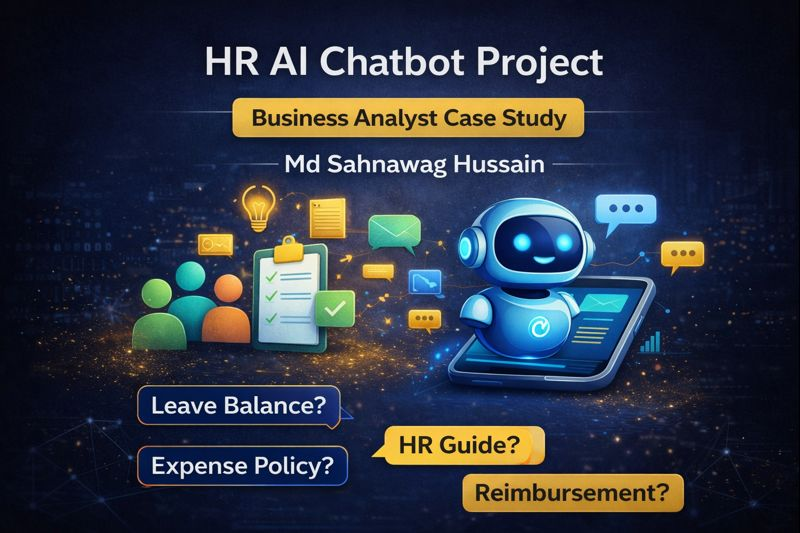
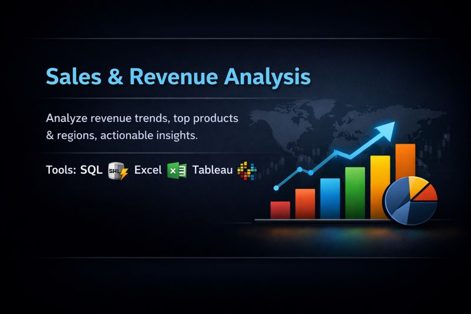
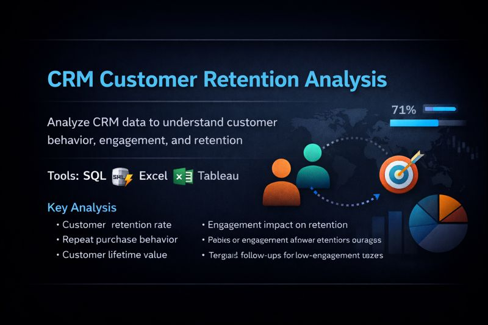
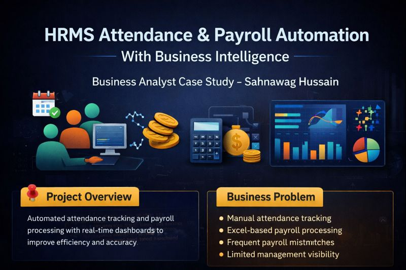
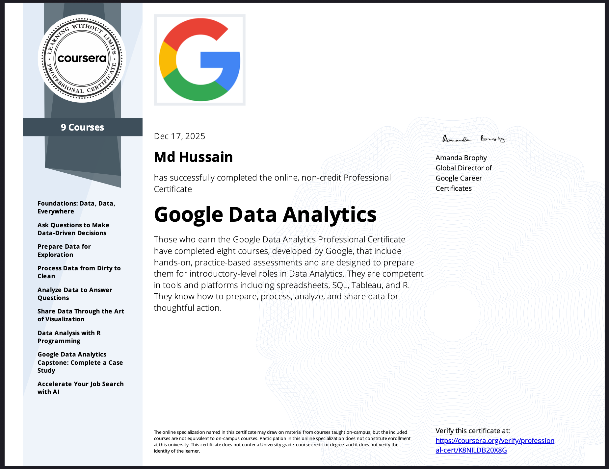

  

    <h1>Turning Data into Business Decisions</h1>
    <h2>Business Analyst & Project Manager</h2>

    

      👋 Hi, I’m <strong>Sahnawag Hussain</strong> — a Business Analyst & Project Manager specializing in <strong>AI Process Automation, CRM Analytics, and Data-Driven Strategy</strong>.
        
      Google Data Analytics Certified with hands-on experience in <strong>RAG Architecture</strong>, <strong>Salesforce Administration</strong>, and turning complex datasets into actionable business growth.
    

    

      <a href="https://github.com/SahnawagHussain" class="hero-btn">View GitHub</a>
      <a href="https://www.linkedin.com/in/sahnawag" class="hero-btn">Connect on LinkedIn</a>
    

  

  

    
  

---

## 💼 Skills

  

    
GenAI & RAG Architecture

    

70%

  

  
  

    
SQL

    

75%

  

  
  

    
Excel

    

85%

  

  
  

    
Tableau

    

80%

  

  
  

    
Python

    

65%

  

  
  

    
CRM Exposure: Salesforce, Monday.com

    

80%

  

  
  

    
Jira Project Management

    

80%

  

  
  

    
Salesforce Administrator

    

75%

  

---

## 📂 Projects

  

    
    <h3>HR Policy AI Chatbot (RAG)</h3>
    
Designed a RAG-based AI agent to automate 70% of HR queries. Features "Fail-Safe" Salesforce escalation and Tableau analytics.

    <a href="https://github.com/SahnawagHussain/business-analyst-portfolio/tree/main/HR-Policy-AI-Chatbot" class="project-btn">View on GitHub</a>
  

  

    
    <h3>Sales & Revenue Analysis</h3>
    
Analyze revenue trends, top products & regions, actionable business recommendations.

    <a href="https://github.com/SahnawagHussain/business-analyst-portfolio/tree/main/Project-1-Sales-Revenue-Analysis" class="project-btn">View on GitHub</a>
  

  

    
    <h3>CRM Customer Retention Analysis</h3>
    
Analyze customer behavior, engagement, retention, and actionable business insights.

    <a href="https://github.com/SahnawagHussain/business-analyst-portfolio/tree/main/Project-2-CRM-Customer-Retention" class="project-btn">View on GitHub</a>
  

  

    
    <h3>HRMS Attendance & Payroll Case Study</h3>
    
Analyze attendance, payroll, and HR processes; dashboards and insights for management decision-making.

    <a href="https://github.com/SahnawagHussain/business-analyst-portfolio/tree/main/HRMS-Attendance-Payroll-BA-Case-Study" class="project-btn">View on GitHub</a>
  

---

## 🎓 Certification

### Google Data Analytics Professional Certificate  
Issued by Google via Coursera  

---

## 📬 Contact

Email: <a href="mailto:sahil786hussain127@gmail.com">sahil786hussain127@gmail.com</a> 
LinkedIn: <a href="https://www.linkedin.com/in/sahnawag" target="_blank">linkedin.com/in/sahnawag</a> 
GitHub: <a href="https://github.com/SahnawagHussain" target="_blank">github.com/SahnawagHussain</a>

